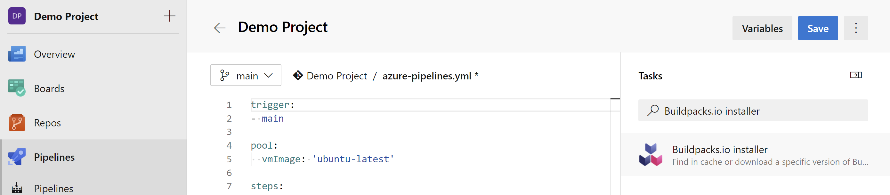
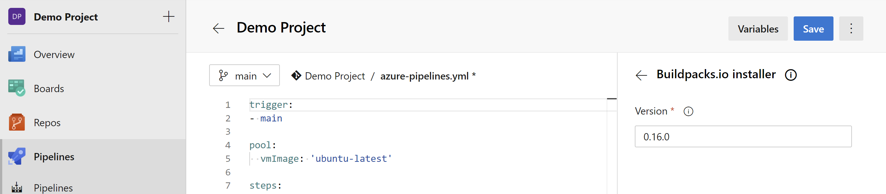
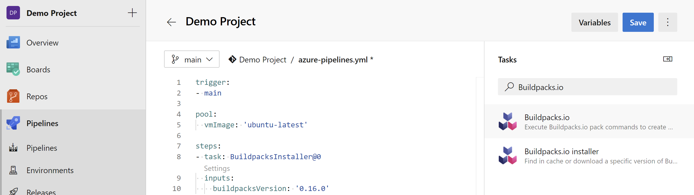
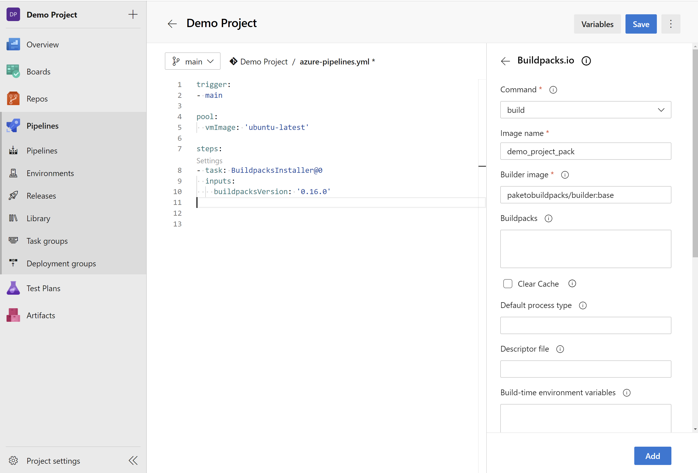

## About Buildpacks.io

Buildpacks is a concept designed by Heroku in 2011 and has since gained widespread adoption across all PaaS platforms. The Cloud Native Cloud Foundation Buildpacks.io standard defines an open standard for buildpack builders to adhere to, allowing the end-user to choose a builder of choice. A central feature of buildpacks is examining applications and determining the required framework, library and runtime support. The builder decides an appropriate buildpack, downloads all required dependencies and configure the application with the discovered dependencies in an OCI compliant container ready for launch, hassle-free.

## About the Buildpacks.io extension

This extension provides the following components:
- A task for installing a specific version of Buildpacks.io CLI tool, if not already installed, on the agent
- A task for executing the core Buildpacks.io pack commands

The Buildpacks.io tool installer task acquires a specified version of [Buildpacks.io](https://buildpacks.io/) from the Internet or the tools cache and prepends it to the PATH of the Azure Pipelines Agent (hosted or private). One can use this task to change the version of Buildpacks.io CLI used in subsequent tasks. Adding this task before the [Buildpacks.io task]() in a build definition ensures you are using that task with the right Buildpacks.io CLI version.

The Buildpacks.io task enables running pack commands as part of Azure Build and Release Pipelines.

This extension is intended to run on **Windows**, **Linux** and **MacOS** agents.

## Buildpacks.io tool installer task

- Search for **Buildpacks.io tool installer** and click on **Add**

- In the **Version** input, select the exact version of Buildpacks.io CLI you want to install on the build agent. e.g. if you want to install version 0.16.0, enter `0.16.0`

## Buildpacks.io task

- Search for **Buildpacks.io** and click on **Add**

- From the **Command** list, select the pack command to execute.

